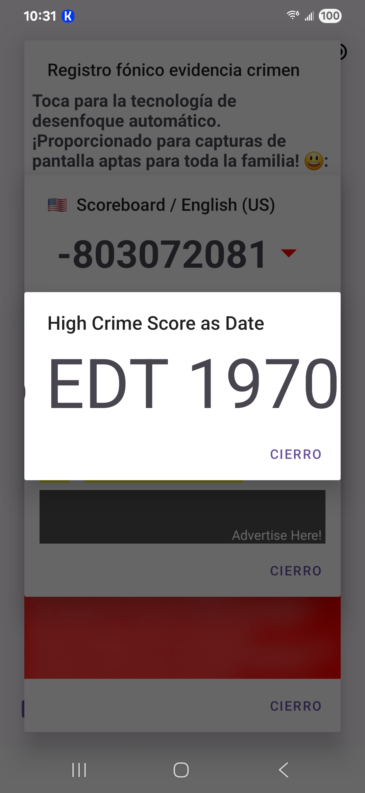
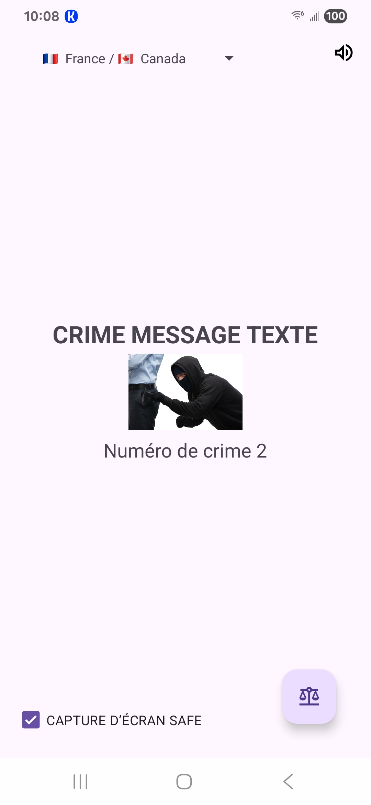

# crimeinspector089

> **💡`Did you know?`**
> Google requires sensitive information to include phone number, living address, a hefty fee, and a photo ID to foreign nationals, twice?  Once from a third party!

> **💡`Did you know?`**
> Google has no idea where our information is on their servers?  Instead, consumer data is copied locally and passed around.

> **💡`Did you know?`**
> All Google products are security risks in the future, while some are immediate?

> **📢`Industry Public Service Announcement`**
> The only working MMS solution is provided by the guys at https://github.com/klinker41/android-smsmms and it no longer works due to a network error 4 (around 11/25/2026 it stopped working).  Please revert back to the older versions on your networks.

> **🤸🏽`FUN FACT!`**
>  According to Google Play Ticket '**3-9316000040910'**, crimeinspector089 is **'resolved'** without our publishing, meaning **Android OS will permanently have a cloud based dialer only** in the foreseeable future.  This means we will continue to make calls from websites.

> **🤸🏽`FUN FACT!`**
> A cloud based dialer, unencrypted, is illegal and unfair.

---
Feel free to decompile it!

https://www.crimeinspector089.com

hosted by GoDaddy.com __(not involved)__.

### Now with (some) multilingual support!

__Version 3 updates:__ 

* Added library for enhanced UX support
* Brand new scoreboard!
  
__Version 2 updates:__ 

* Volume bug fix and improved UX
* Added open-sourced libraries --- +1 FREE!
* Advertise with us!
