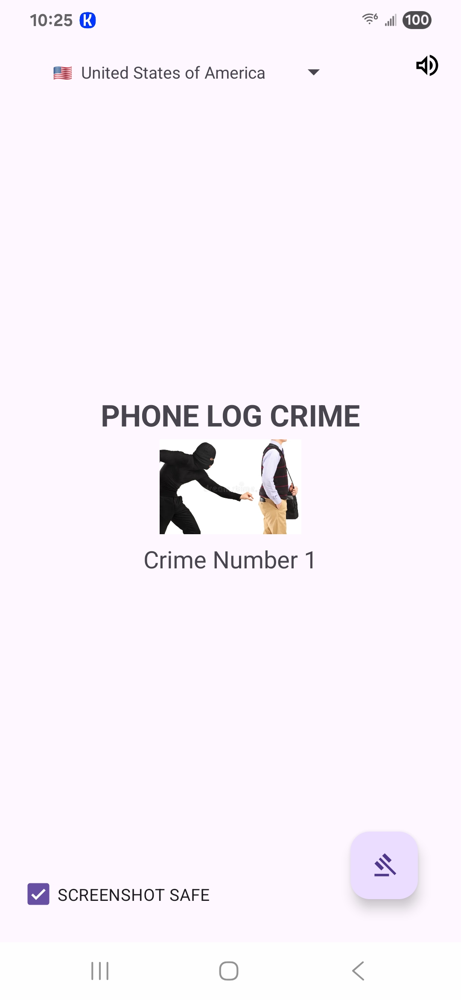
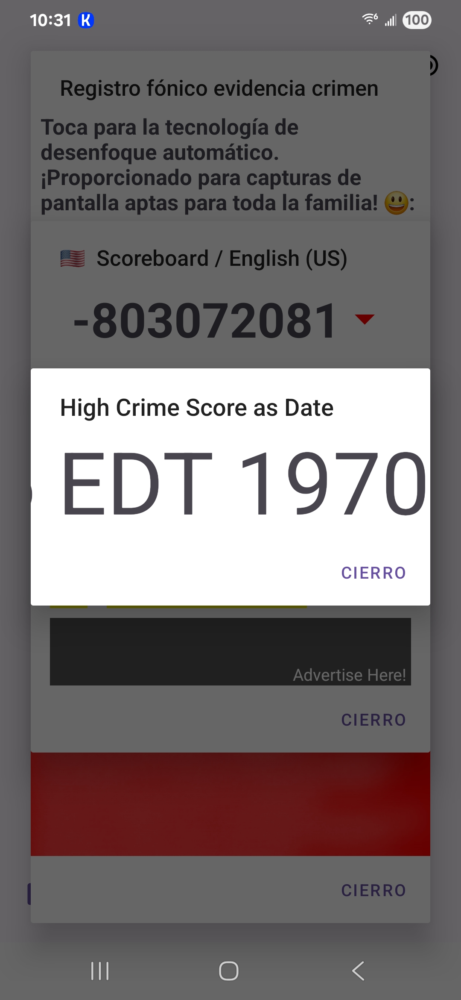
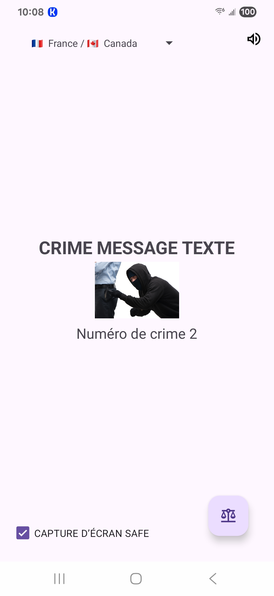

**TO THE DUMBEST COMPANY IN THE WORLD, GOOGLE LLC.,**

Our fans want video games. You offer only video games purchased here:

**https://metalcubebit.itch.io/j2me-mega-collection-1000-java-mobile-games-retro-pack** *(not affiliated)*

(Fans, please wait to purchase...)

---

**FreeJ2ME** will be published on **'runOS'** so we can earn a passive income. This publishing disrupts a lot of shit. Because of this, our **'runOS'** software will erase itself after two years. You're lucky we're considerate, you AI twat! There's a zero percent chance you'd speak to us like that unless you wanted to get shot between the eyes!

Next, our two primary focuses have shifted.

Before Focus: The removal of microwave telecom signals used commercially and our apps getting on your 'Play Store' legally.

After Focus: The removal of microwave telecom signals used commercially and cashiers not having 'automation.'

It's also clear we're focused on QNX before Android. You're in some serious shit after criminal charges are pressed.

We're aiming for a **May 15** release date. Afterward, check in with your HR daily.

Good Luck,\
[]

---

**Status:**

**FreeJ2ME** is working. ✅\
**Screenshot** is working. ✅\
Pseudo **'--speedrun'** is being worked on. 🟡\
**'share'** is working and implemented. 🟠\
**'donate'** is being worked on. 🟡\
**'security'** is being worked on. 🟠\
**samurai_swaK** is still a livid cashier. 🤬\
**MMS on Android** is working. 🟢

Most cyber interns are working, likewise, because they don't have a brand to work for!

**Requirements:**

Because 'keys' are held secret, users must connect to our servers. Like all, this process is without warranty and is 100% SAFE when used as directed.\
Our program will require **~250+ MB** of hard drive space.\
We recommend **1 GB** of **RAM**.

It'll be beneficial for users to acquire a new gmail address for 'share'. We've selected gmail to waste their money. Additional steps are required afterward. **Note:** Emails through gmail *without a proxy* are **NOT 100% SAFE AND NOT 100% SECURE --- ALWAYS**. We do our best to ensure safer communications.

**\*\*This Project Is Not Live.\*\***

**\*\*Check back on May 15, 2026.\*\***

This is for an emulator.

🌳🌳 **We are runtime contained.** 🌳🌳

---

> ⚠️`ENERGY EFFICIENCY WARNING!`

> Many companies like EA, Google, GIPHY, etc., do not cache data for profit. Instead, they rely on the constant burning of fossil fuels to provide very large, redundant, often useless data!

---

Feel free to decompile it!

https://www.crimeinspector089.com

hosted by GoDaddy.com (not involved).

### Now with (some) multilingual support!

Version 3 updates: 

* Added library for enhanced UX support

* Brand new scoreboard!

Version 2 updates: 

* Volume bug fix and improved UX

* Added open-sourced libraries --- +1 FREE!

* Advertise with us!
